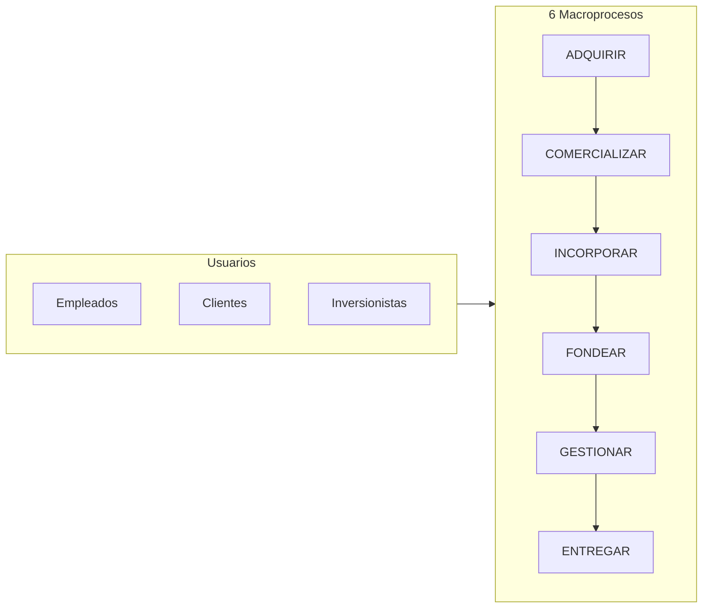
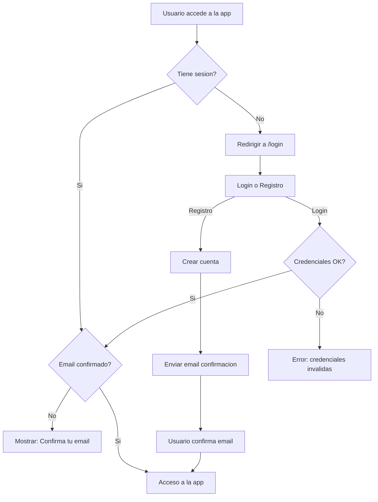
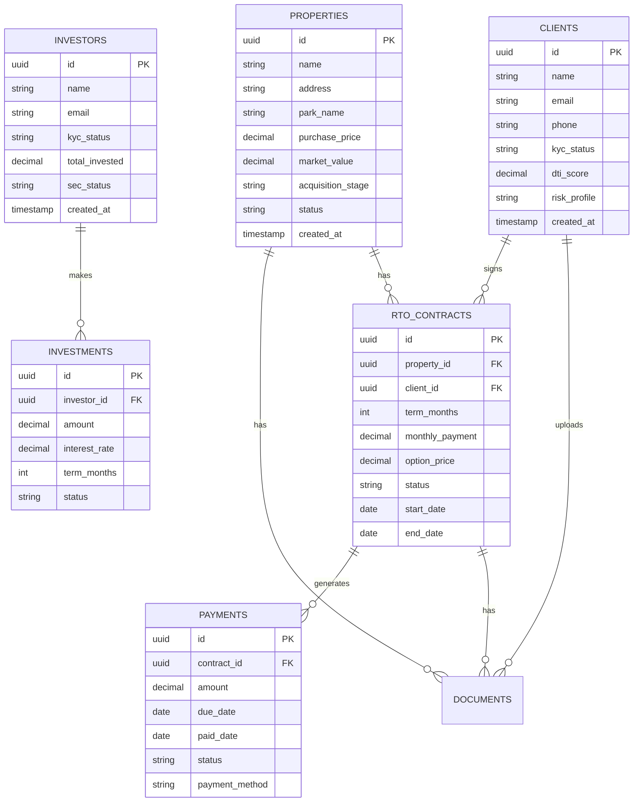
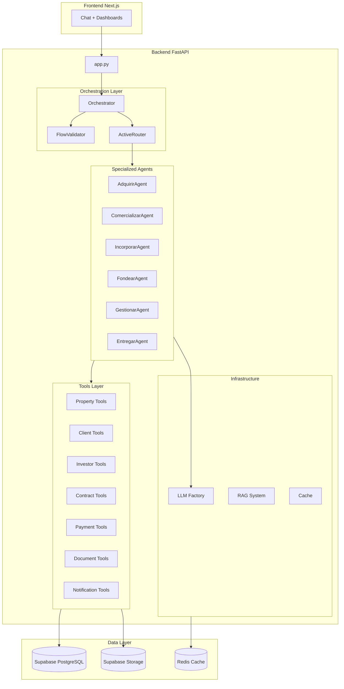
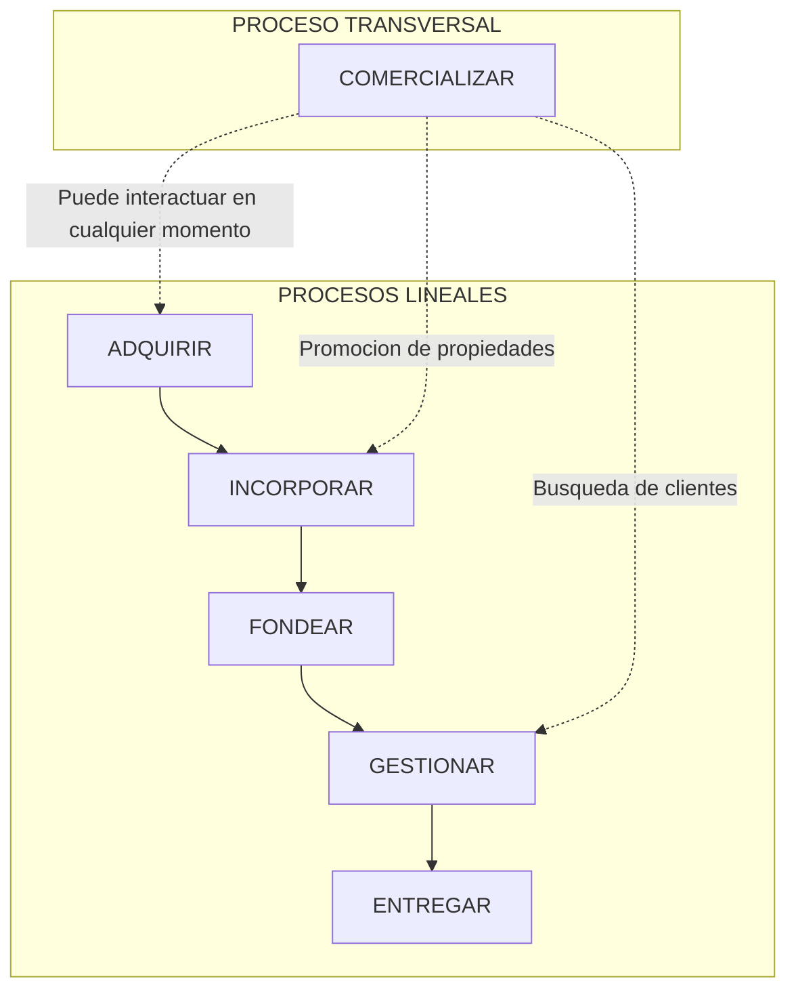

# Draft 1: Tronco Común Maninos AI v3.0

## 1. Visión General

Sistema agéntico para automatizar los 6 macroprocesos del negocio rent-to-own de mobile homes en Texas:



**Decisiones arquitectónicas clave:**

- LangGraph SOLO para checkpointing/sesiones
- Agentes custom con ChatOpenAI directo (patrón ReAct manual)
- Orchestrator custom para routing entre procesos
- Abstraccion LLM preparada para OpenRouter (Fase 2)
- Supabase Auth para autenticacion de usuarios
- Row Level Security (RLS) en todas las tablas

---

## 2. Autenticacion y Seguridad

### 2.1 Supabase Auth

Utilizaremos Supabase Auth para gestionar la autenticacion de usuarios:**Metodos de autenticacion:**

- Email + Password (principal)
- Confirmacion de email obligatoria
- Reset password via email

**Tipos de usuarios:**| Rol | Descripcion | Acceso ||-----|-------------|--------|| `employee` | Empleados de Maninos | Todos los procesos || `client` | Clientes rent-to-own | Solo su perfil y contrato || `investor` | Inversionistas | Solo sus inversiones || `admin` | Administradores | Todo + configuracion |**Configuracion Supabase Auth:**

```sql
-- Habilitar confirmacion de email en Supabase Dashboard:
-- Authentication > Settings > Email Auth > Confirm email = ON

-- Crear tabla de perfiles extendida
CREATE TABLE public.profiles (
    id UUID PRIMARY KEY REFERENCES auth.users(id) ON DELETE CASCADE,
    role TEXT NOT NULL DEFAULT 'employee' CHECK (role IN ('employee', 'client', 'investor', 'admin')),
    full_name TEXT,
    phone TEXT,
    company TEXT,
    created_at TIMESTAMP WITH TIME ZONE DEFAULT NOW(),
    updated_at TIMESTAMP WITH TIME ZONE DEFAULT NOW()
);

-- Trigger para crear perfil automaticamente al registrarse
CREATE OR REPLACE FUNCTION public.handle_new_user()
RETURNS TRIGGER AS $$
BEGIN
    INSERT INTO public.profiles (id, full_name)
    VALUES (NEW.id, NEW.raw_user_meta_data->>'full_name');
    RETURN NEW;
END;
$$ LANGUAGE plpgsql SECURITY DEFINER;

CREATE TRIGGER on_auth_user_created
    AFTER INSERT ON auth.users
    FOR EACH ROW EXECUTE FUNCTION public.handle_new_user();
```


### 2.2 Frontend Auth (Next.js)

**Estructura de archivos:**

```javascript
web/src/
├── app/
│   ├── (auth)/
│   │   ├── login/
│   │   │   └── page.tsx          # Pagina de login
│   │   ├── register/
│   │   │   └── page.tsx          # Pagina de registro
│   │   ├── reset-password/
│   │   │   └── page.tsx          # Reset password
│   │   └── confirm/
│   │       └── page.tsx          # Confirmacion email
│   ├── (protected)/
│   │   ├── layout.tsx            # Layout con auth check
│   │   ├── dashboard/
│   │   │   └── page.tsx          # Dashboard principal
│   │   └── ...                   # Resto de la app
│   └── layout.tsx
├── components/
│   └── auth/
│       ├── LoginForm.tsx
│       ├── RegisterForm.tsx
│       ├── AuthProvider.tsx      # Context provider
│       └── ProtectedRoute.tsx    # HOC para rutas protegidas
├── hooks/
│   └── useAuth.ts                # Hook de autenticacion
└── lib/
    └── supabase-client.ts        # Cliente Supabase browser
```

**Flujo de autenticacion:**



**Componente AuthProvider:**

```typescript
// web/src/components/auth/AuthProvider.tsx
'use client'
import { createContext, useContext, useEffect, useState } from 'react'
import { User, Session } from '@supabase/supabase-js'
import { supabase } from '@/lib/supabase-client'

interface AuthContextType {
    user: User | null
    session: Session | null
    loading: boolean
    signIn: (email: string, password: string) => Promise<void>
    signUp: (email: string, password: string, fullName: string) => Promise<void>
    signOut: () => Promise<void>
}

const AuthContext = createContext<AuthContextType | undefined>(undefined)

export function AuthProvider({ children }: { children: React.ReactNode }) {
    const [user, setUser] = useState<User | null>(null)
    const [session, setSession] = useState<Session | null>(null)
    const [loading, setLoading] = useState(true)

    useEffect(() => {
        // Obtener sesion inicial
        supabase.auth.getSession().then(({ data: { session } }) => {
            setSession(session)
            setUser(session?.user ?? null)
            setLoading(false)
        })

        // Escuchar cambios de auth
        const { data: { subscription } } = supabase.auth.onAuthStateChange(
            (_event, session) => {
                setSession(session)
                setUser(session?.user ?? null)
            }
        )

        return () => subscription.unsubscribe()
    }, [])

    // ... implementar signIn, signUp, signOut
    
    return (
        <AuthContext.Provider value={{ user, session, loading, signIn, signUp, signOut }}>
            {children}
        </AuthContext.Provider>
    )
}

export const useAuth = () => {
    const context = useContext(AuthContext)
    if (!context) throw new Error('useAuth must be used within AuthProvider')
    return context
}
```


### 2.3 Row Level Security (RLS)

**Principio: Cada tabla tiene RLS habilitado y politicas explicitas.Politicas por tabla:**

```sql
-- ============================================
-- PROFILES (perfil de usuario)
-- ============================================
ALTER TABLE public.profiles ENABLE ROW LEVEL SECURITY;

-- Usuario puede ver y editar solo su perfil
CREATE POLICY "Users can view own profile"
    ON public.profiles FOR SELECT
    USING (auth.uid() = id);

CREATE POLICY "Users can update own profile"
    ON public.profiles FOR UPDATE
    USING (auth.uid() = id);

-- Admins pueden ver todos los perfiles
CREATE POLICY "Admins can view all profiles"
    ON public.profiles FOR SELECT
    USING (
        EXISTS (
            SELECT 1 FROM public.profiles
            WHERE id = auth.uid() AND role = 'admin'
        )
    );

-- ============================================
-- PROPERTIES
-- ============================================
ALTER TABLE public.properties ENABLE ROW LEVEL SECURITY;

-- Empleados y admins pueden ver todas las propiedades
CREATE POLICY "Employees can view all properties"
    ON public.properties FOR SELECT
    USING (
        EXISTS (
            SELECT 1 FROM public.profiles
            WHERE id = auth.uid() AND role IN ('employee', 'admin')
        )
    );

-- Empleados pueden crear/editar propiedades
CREATE POLICY "Employees can manage properties"
    ON public.properties FOR ALL
    USING (
        EXISTS (
            SELECT 1 FROM public.profiles
            WHERE id = auth.uid() AND role IN ('employee', 'admin')
        )
    );

-- Clientes solo ven propiedades de sus contratos
CREATE POLICY "Clients can view their properties"
    ON public.properties FOR SELECT
    USING (
        EXISTS (
            SELECT 1 FROM public.rto_contracts c
            JOIN public.clients cl ON c.client_id = cl.id
            WHERE c.property_id = properties.id
            AND cl.user_id = auth.uid()
        )
    );

-- ============================================
-- CLIENTS
-- ============================================
ALTER TABLE public.clients ENABLE ROW LEVEL SECURITY;

-- Cliente puede ver solo su propio perfil
CREATE POLICY "Clients can view own record"
    ON public.clients FOR SELECT
    USING (user_id = auth.uid());

-- Empleados pueden ver todos los clientes
CREATE POLICY "Employees can view all clients"
    ON public.clients FOR SELECT
    USING (
        EXISTS (
            SELECT 1 FROM public.profiles
            WHERE id = auth.uid() AND role IN ('employee', 'admin')
        )
    );

-- Empleados pueden gestionar clientes
CREATE POLICY "Employees can manage clients"
    ON public.clients FOR ALL
    USING (
        EXISTS (
            SELECT 1 FROM public.profiles
            WHERE id = auth.uid() AND role IN ('employee', 'admin')
        )
    );

-- ============================================
-- INVESTORS
-- ============================================
ALTER TABLE public.investors ENABLE ROW LEVEL SECURITY;

-- Inversionista puede ver solo su propio perfil
CREATE POLICY "Investors can view own record"
    ON public.investors FOR SELECT
    USING (user_id = auth.uid());

-- Empleados pueden ver todos los inversionistas
CREATE POLICY "Employees can view all investors"
    ON public.investors FOR SELECT
    USING (
        EXISTS (
            SELECT 1 FROM public.profiles
            WHERE id = auth.uid() AND role IN ('employee', 'admin')
        )
    );

-- ============================================
-- RTO_CONTRACTS
-- ============================================
ALTER TABLE public.rto_contracts ENABLE ROW LEVEL SECURITY;

-- Clientes pueden ver solo sus contratos
CREATE POLICY "Clients can view own contracts"
    ON public.rto_contracts FOR SELECT
    USING (
        EXISTS (
            SELECT 1 FROM public.clients
            WHERE clients.id = rto_contracts.client_id
            AND clients.user_id = auth.uid()
        )
    );

-- Empleados pueden gestionar todos los contratos
CREATE POLICY "Employees can manage all contracts"
    ON public.rto_contracts FOR ALL
    USING (
        EXISTS (
            SELECT 1 FROM public.profiles
            WHERE id = auth.uid() AND role IN ('employee', 'admin')
        )
    );

-- ============================================
-- PAYMENTS
-- ============================================
ALTER TABLE public.payments ENABLE ROW LEVEL SECURITY;

-- Clientes pueden ver solo sus pagos
CREATE POLICY "Clients can view own payments"
    ON public.payments FOR SELECT
    USING (
        EXISTS (
            SELECT 1 FROM public.rto_contracts c
            JOIN public.clients cl ON c.client_id = cl.id
            WHERE c.id = payments.contract_id
            AND cl.user_id = auth.uid()
        )
    );

-- Empleados pueden gestionar todos los pagos
CREATE POLICY "Employees can manage all payments"
    ON public.payments FOR ALL
    USING (
        EXISTS (
            SELECT 1 FROM public.profiles
            WHERE id = auth.uid() AND role IN ('employee', 'admin')
        )
    );

-- ============================================
-- INVESTMENTS
-- ============================================
ALTER TABLE public.investments ENABLE ROW LEVEL SECURITY;

-- Inversionistas pueden ver solo sus inversiones
CREATE POLICY "Investors can view own investments"
    ON public.investments FOR SELECT
    USING (
        EXISTS (
            SELECT 1 FROM public.investors
            WHERE investors.id = investments.investor_id
            AND investors.user_id = auth.uid()
        )
    );

-- Empleados pueden gestionar todas las inversiones
CREATE POLICY "Employees can manage all investments"
    ON public.investments FOR ALL
    USING (
        EXISTS (
            SELECT 1 FROM public.profiles
            WHERE id = auth.uid() AND role IN ('employee', 'admin')
        )
    );

-- ============================================
-- DOCUMENTS
-- ============================================
ALTER TABLE public.documents ENABLE ROW LEVEL SECURITY;

-- Politica basada en entidad relacionada
CREATE POLICY "Users can view related documents"
    ON public.documents FOR SELECT
    USING (
        -- Empleados ven todo
        EXISTS (
            SELECT 1 FROM public.profiles
            WHERE id = auth.uid() AND role IN ('employee', 'admin')
        )
        OR
        -- Clientes ven docs de sus contratos
        (entity_type = 'contract' AND EXISTS (
            SELECT 1 FROM public.rto_contracts c
            JOIN public.clients cl ON c.client_id = cl.id
            WHERE c.id = documents.entity_id
            AND cl.user_id = auth.uid()
        ))
        OR
        -- Inversionistas ven docs de sus inversiones
        (entity_type = 'investment' AND EXISTS (
            SELECT 1 FROM public.investments i
            JOIN public.investors inv ON i.investor_id = inv.id
            WHERE i.id = documents.entity_id
            AND inv.user_id = auth.uid()
        ))
    );
```


### 2.4 Backend Auth (FastAPI)

**Verificacion de JWT en el backend:**

```python
# utils/auth.py
from fastapi import Depends, HTTPException, status
from fastapi.security import HTTPBearer, HTTPAuthorizationCredentials
from supabase import create_client
import os

security = HTTPBearer()

async def get_current_user(
    credentials: HTTPAuthorizationCredentials = Depends(security)
) -> dict:
    """Verificar JWT y obtener usuario actual."""
    token = credentials.credentials
    
    supabase = create_client(
        os.getenv("SUPABASE_URL"),
        os.getenv("SUPABASE_SERVICE_ROLE_KEY")
    )
    
    try:
        # Verificar token con Supabase
        user = supabase.auth.get_user(token)
        if not user:
            raise HTTPException(
                status_code=status.HTTP_401_UNAUTHORIZED,
                detail="Invalid token"
            )
        return user.user
    except Exception as e:
        raise HTTPException(
            status_code=status.HTTP_401_UNAUTHORIZED,
            detail=str(e)
        )

async def require_employee(user: dict = Depends(get_current_user)) -> dict:
    """Requerir rol de empleado o admin."""
    # Obtener perfil con rol
    supabase = create_client(
        os.getenv("SUPABASE_URL"),
        os.getenv("SUPABASE_SERVICE_ROLE_KEY")
    )
    
    profile = supabase.table("profiles").select("role").eq("id", user.id).single().execute()
    
    if profile.data.get("role") not in ["employee", "admin"]:
        raise HTTPException(
            status_code=status.HTTP_403_FORBIDDEN,
            detail="Employee access required"
        )
    
    return user
```

**Uso en endpoints:**

```python
# app.py
from utils.auth import get_current_user, require_employee

@app.post("/api/chat")
async def chat(
    request: ChatRequest,
    user: dict = Depends(get_current_user)  # Requiere autenticacion
):
    # user.id disponible para RLS
    ...

@app.post("/api/admin/users")
async def manage_users(
    request: AdminRequest,
    user: dict = Depends(require_employee)  # Solo empleados
):
    ...
```

---

## 3. Schema de Base de Datos

### 3.1 Modificaciones para Auth

Las tablas principales necesitan columnas para vincular con Supabase Auth:

```sql
-- Añadir user_id a clients (vincula cliente con su cuenta auth)
ALTER TABLE public.clients ADD COLUMN user_id UUID REFERENCES auth.users(id);
CREATE INDEX idx_clients_user_id ON public.clients(user_id);

-- Añadir user_id a investors (vincula inversionista con su cuenta auth)
ALTER TABLE public.investors ADD COLUMN user_id UUID REFERENCES auth.users(id);
CREATE INDEX idx_investors_user_id ON public.investors(user_id);
```


### 3.2 Entidades Principales




### 3.3 Migraciones SQL Propuestas

Crear archivo: `migrations/2026-01-15_tronco_comun_init.sql`**Nuevas tablas:**

- `clients` - Clientes del programa rent-to-own
- `investors` - Inversionistas que fondean operaciones
- `rto_contracts` - Contratos rent-to-own (24/36/48 meses)
- `payments` - Pagos mensuales de clientes
- `investments` - Notas de deuda de inversionistas
- `process_logs` - Auditoría de acciones por proceso

**Modificaciones:**

- `properties` - Añadir campos para tracking de adquisición completo
- `documents` - Generalizar para soportar múltiples entidades (property, client, investor, contract)

---

## 4. Arquitectura de Agentes

### 4.1 Diagrama de Componentes




### 4.2 Definición de Cada Agente

| Agente | Responsabilidad | Tools Principales ||--------|-----------------|-------------------|| **AdquirirAgent** | Sourcing y compra de propiedades | `search_properties_market`, `evaluate_property`, `create_property`, `register_inventory` || **ComercializarAgent** | Promoción y venta inicial | `list_available_properties`, `receive_application`, `evaluate_credit`, `formalize_sale` || **IncorporarAgent** | Onboarding de clientes | `create_client`, `verify_kyc`, `evaluate_dti`, `personalize_contract`, `send_followup` || **FondearAgent** | Gestión de inversionistas | `create_investor`, `verify_investor_kyc`, `create_investment`, `generate_promissory_note` || **GestionarAgent** | Administración de cartera | `generate_rto_contract`, `process_payment`, `monitor_delinquency`, `generate_report` || **EntregarAgent** | Cierre y transferencia | `verify_eligibility`, `transfer_title`, `offer_renewal`, `process_referral` |

### 4.3 Estructura de Archivos Propuesta

```javascript
agents/
├── __init__.py
├── base_agent.py              # Reutilizar existente
├── adquirir_agent.py          # NUEVO
├── comercializar_agent.py     # NUEVO
├── incorporar_agent.py        # NUEVO
├── fondear_agent.py           # NUEVO
├── gestionar_agent.py         # NUEVO
├── entregar_agent.py          # NUEVO

router/
├── orchestrator.py            # Adaptar existente
├── flow_validator.py          # Reescribir para 6 procesos
├── active_router.py           # Adaptar existente

tools/
├── registry.py                # Expandir
├── property_tools.py          # Adaptar
├── client_tools.py            # NUEVO
├── investor_tools.py          # NUEVO
├── contract_tools.py          # Expandir
├── payment_tools.py           # NUEVO
├── notification_tools.py      # NUEVO (alertas, emails)

prompts/
└── agents/
    ├── adquirir_agent/
    │   └── _base.md           # NUEVO
    ├── comercializar_agent/
    │   └── _base.md           # NUEVO
    ├── incorporar_agent/
    │   └── _base.md           # NUEVO
    ├── fondear_agent/
    │   └── _base.md           # NUEVO
    ├── gestionar_agent/
    │   └── _base.md           # NUEVO
    └── entregar_agent/
        └── _base.md           # NUEVO

utils/
├── llm_factory.py             # NUEVO - Abstracción para OpenRouter
```

---

## 5. FlowValidator (6 Macroprocesos)

### 5.1 Arquitectura de Procesos (ACTUALIZADO)

**IMPORTANTE:** COMERCIALIZAR es un proceso TRANSVERSAL que puede ocurrir en cualquier momento.Los demas procesos son mas lineales: ADQUIRIR → INCORPORAR → FONDEAR → GESTIONAR → ENTREGAR⏳ **Pendiente:** Diagrama exacto de relaciones del cliente




### 5.2 Estados por Proceso

**ADQUIRIR (Lineal):**

```javascript
Sourcing → Evaluacion → DueDiligence → Negociacion → Registrado
```

**COMERCIALIZAR (Transversal - siempre disponible):**

```javascript
Promocion ↔ SolicitudRecibida ↔ CreditoEvaluado ↔ VentaFormalizada
```

**INCORPORAR (Lineal):**

```javascript
Perfilado → KYCVerificado → DTIEvaluado → ContratoPersonalizado
```

**FONDEAR (Lineal):**

```javascript
InversionistaContactado → InversionistaOnboarded → NotaEstructurada
```

**GESTIONAR (Lineal):**

```javascript
ContratoActivo → PagosMonitoreados → ReporteGenerado
```

**ENTREGAR (Lineal):**

```javascript
ElegibilidadVerificada → TituloTransferido → Fidelizado
```


### 5.3 Logica del FlowValidator

Archivo: `router/flow_validator.py`

```python
# Estructura propuesta (pseudocodigo)

# COMERCIALIZAR es transversal - siempre disponible
TRANSVERSAL_PROCESSES = ["COMERCIALIZAR"]

# Procesos lineales con orden definido
LINEAR_PROCESSES = {
    "ADQUIRIR": {
        "stages": ["sourcing", "evaluacion", "due_diligence", "negociacion", "registrado"],
        "agent": "AdquirirAgent",
        "entity": "property",
        "order": 1
    },
    "INCORPORAR": {
        "stages": ["perfilado", "kyc_verificado", "dti_evaluado", "contrato_personalizado"],
        "agent": "IncorporarAgent",
        "entity": "client",
        "order": 2
    },
    "FONDEAR": {
        "stages": ["inversionista_contactado", "inversionista_onboarded", "nota_estructurada"],
        "agent": "FondearAgent",
        "entity": "investor",
        "order": 3
    },
    "GESTIONAR": {
        "stages": ["contrato_activo", "pagos_monitoreados", "reporte_generado"],
        "agent": "GestionarAgent",
        "entity": "contract",
        "order": 4
    },
    "ENTREGAR": {
        "stages": ["elegibilidad_verificada", "titulo_transferido", "fidelizado"],
        "agent": "EntregarAgent",
        "entity": "contract",
        "order": 5
    }
}

# Proceso transversal
TRANSVERSAL_PROCESS = {
    "COMERCIALIZAR": {
        "stages": ["promocion", "solicitud_recibida", "credito_evaluado", "venta_formalizada"],
        "agent": "ComercializarAgent",
        "entity": "property",
        "always_available": True  # Puede ser invocado en cualquier momento
    }
}

def can_access_process(current_state, target_process):
    """Determina si un proceso puede ser accedido."""
    # COMERCIALIZAR siempre disponible
    if target_process in TRANSVERSAL_PROCESSES:
        return True
    
    # Para procesos lineales, verificar orden
    # (logica dependera del diagrama del cliente)
    return check_linear_requirements(current_state, target_process)
```

---

## 6. Abstracción LLM (Preparación OpenRouter)

### 6.1 LLM Factory

Archivo: `utils/llm_factory.py`

```python
# Estructura propuesta
def get_llm(
    model: str = "gpt-4o-mini",
    provider: str = "openai",  # "openai" | "openrouter"
    temperature: float = 0.0
) -> ChatOpenAI:
    """
    Factory para crear instancias de LLM.
    Preparado para switch fácil a OpenRouter en Fase 2.
    """
    if provider == "openrouter":
        return ChatOpenAI(
            model=f"openai/{model}",
            api_key=os.getenv("OPENROUTER_API_KEY"),
            base_url="https://openrouter.ai/api/v1",
            temperature=temperature
        )
    else:
        return ChatOpenAI(
            model=model,
            api_key=os.getenv("OPENAI_API_KEY"),
            temperature=temperature
        )
```


### 6.2 Configuración por Agente

```python
# Cada agente puede tener su modelo óptimo
AGENT_LLM_CONFIG = {
    "AdquirirAgent": {"model": "gpt-4o-mini", "temperature": 0.0},
    "ComercializarAgent": {"model": "gpt-4o-mini", "temperature": 0.3},
    "IncorporarAgent": {"model": "gpt-4o-mini", "temperature": 0.0},
    "FondearAgent": {"model": "gpt-4o", "temperature": 0.0},  # Más complejo
    "GestionarAgent": {"model": "gpt-4o-mini", "temperature": 0.0},
    "EntregarAgent": {"model": "gpt-4o-mini", "temperature": 0.0},
}
```

---

## 7. Tools por Proceso

### 7.1 ADQUIRIR Tools

| Tool | Descripción | Archivo ||------|-------------|---------|| `search_market_properties` | Buscar en fuentes (Zillow, MHVillage, etc.) | `tools/market_tools.py` || `evaluate_property_criteria` | Evaluar vs criterios (70% rule) | `tools/property_tools.py` || `create_property` | Crear propiedad en inventario | `tools/property_tools.py` || `update_property_stage` | Actualizar etapa de adquisición | `tools/property_tools.py` |

### 7.2 COMERCIALIZAR Tools

| Tool | Descripción | Archivo ||------|-------------|---------|| `list_available_properties` | Listar propiedades disponibles | `tools/property_tools.py` || `receive_client_application` | Recibir solicitud de cliente | `tools/client_tools.py` || `evaluate_credit` | Consultar buró de crédito | `tools/credit_tools.py` || `formalize_sale` | Formalizar venta inicial | `tools/contract_tools.py` |

### 7.3 INCORPORAR Tools

| Tool | Descripción | Archivo ||------|-------------|---------|| `create_client` | Crear perfil de cliente | `tools/client_tools.py` || `verify_kyc` | Verificar identidad (KYC) | `tools/compliance_tools.py` || `evaluate_dti` | Calcular DTI (deuda/ingreso) | `tools/client_tools.py` || `personalize_contract` | Personalizar plan (24/36/48 meses) | `tools/contract_tools.py` |

### 7.4 FONDEAR Tools

| Tool | Descripción | Archivo ||------|-------------|---------|| `create_investor` | Crear perfil de inversionista | `tools/investor_tools.py` || `verify_investor_kyc` | KYC de inversionista | `tools/compliance_tools.py` || `create_investment` | Registrar inversión | `tools/investor_tools.py` || `generate_promissory_note` | Generar pagaré | `tools/contract_tools.py` |

### 6.5 GESTIONAR Tools

| Tool | Descripción | Archivo ||------|-------------|---------|| `generate_rto_contract` | Generar contrato RTO | `tools/contract_tools.py` || `process_payment` | Procesar pago mensual | `tools/payment_tools.py` || `monitor_delinquency` | Monitorear morosidad | `tools/payment_tools.py` || `generate_monthly_report` | Generar reporte mensual | `tools/report_tools.py` |

### 7.6 ENTREGAR Tools

| Tool | Descripción | Archivo ||------|-------------|---------|| `verify_purchase_eligibility` | Verificar elegibilidad | `tools/contract_tools.py` || `transfer_title` | Transferir título (TDHCA) | `tools/legal_tools.py` || `offer_renewal` | Ofrecer recompra/upgrade | `tools/client_tools.py` || `process_referral` | Procesar referido | `tools/client_tools.py` |---

## 8. Componentes Reutilizables

Del código existente, reutilizar directamente:| Componente | Archivo | Cambios Necesarios ||------------|---------|-------------------|| BaseAgent | `agents/base_agent.py` | Ninguno || Supabase Client | `tools/supabase_client.py` | Ninguno || Cache | `tools/cache.py` | Ninguno || Email Tool | `tools/email_tool.py` | Ninguno || Voice Tool | `tools/voice_tool.py` | Ninguno || RAG System | `tools/rag_index.py`, `tools/rag_maninos.py` | Adaptar para nuevas entidades || LangGraph Setup | `agentic.py` | Simplificar, solo checkpointer |---

## 8. KPIs y Métricas a Trackear

Basado en el Excel del cliente:| Proceso | KPI | Meta ||---------|-----|------|| ADQUIRIR | Tiempo identificación | ≤10 días || ADQUIRIR | Precio vs mercado | ≤70% || INCORPORAR | Cumplimiento KYC | 100% || INCORPORAR | Tiempo evaluación financiera | ≤48h || FONDEAR | Tasa inversionistas | 12% anual || GESTIONAR | Cobranza puntual | ≥95% || GESTIONAR | Morosidad máxima | ≤5% || GESTIONAR | Ratio deuda-capital | ≤2:1 || ENTREGAR | NPS satisfacción | ≥80 |---

## 10. Supuestos para Draft 1

Este draft asume (a confirmar con cliente en Draft 2):

1. **Orden de procesos:** ADQUIRIR → COMERCIALIZAR → INCORPORAR → FONDEAR → GESTIONAR → ENTREGAR
2. **FONDEAR es paralelo:** Puede ocurrir en cualquier momento cuando se necesita capital
3. **Un cliente = Un contrato activo:** No múltiples propiedades simultáneas
4. **Contratos RTO estándar:** 24, 36 o 48 meses con términos predefinidos
5. **Pagos mensuales:** Cobro automático vía ACH/tarjeta
6. **Sin integraciones externas iniciales:** KYC y crédito manuales en v1

---

## 11. Fases de Implementacion (CALENDARIO REALISTA)

**Duracion total estimada: 5-6 semanas** (con tiempos de revision del cliente)

### Semana 1: Infraestructura Base

| Dia | Tarea ||-----|-------|| 1 | Supabase Auth + paginas login Next.js || 2 | Schema BD (6 tablas) + RLS || 3 | LLM Factory + FlowValidator (COMERCIALIZAR transversal) || 4 | Orchestrator adaptado para 6 agentes || 5 | Testing infraestructura |

### Semana 2: Agentes PRIORITARIOS (peticion cliente)

| Dia | Tarea ||-----|-------|| 1-2 | **ComercializarAgent** + tools (TRANSVERSAL, prioritario) || 3-4 | **AdquirirAgent** + tools (prioritario) || 5 | Testing de ambos agentes |

### Semana 3: Agentes Restantes

| Dia | Tarea ||-----|-------|| 1 | IncorporarAgent + tools || 2 | FondearAgent + tools || 3 | GestionarAgent + tools || 4 | EntregarAgent + tools (incluye generador docs TDHCA) || 5 | Testing integracion todos los agentes |

### Semana 4: UI + Integraciones

| Dia | Tarea ||-----|-------|| 1-2 | Portal Empleados (dashboard, vistas CRUD) || 3 | Integracion Stripe (solo tarjeta) || 4 | KYC manual (UI para verificacion) || 5 | Testing end-to-end |

### Semana 5: Revision Cliente + Ajustes

| Dia | Tarea ||-----|-------|| 1-3 | Cliente revisa v1.0 || 4-5 | Ajustes segun feedback |

### Semana 6: Portal Clientes (si tiempo permite)

| Dia | Tarea ||-----|-------|| 1-2 | Catalogo de casas + comparador || 3-4 | Pre-calificacion automatica || 5 | Deploy v1.0 produccion |---

### Resumen de entregas

| Semana | Entregable ||--------|------------|| 4 | **v1.0 Alpha** - Portal Empleados funcional para revision || 5 | **v1.0 Beta** - Con ajustes del cliente || 6 | **v1.0 Release** - Listo para produccion |---

## 12. Preguntas y Respuestas del Cliente

### Preguntas CRITICAS - TODAS RESPONDIDAS ✅

| # | Pregunta | Respuesta ||---|----------|-----------|| 1 | Orden de los 6 macroprocesos | ✅ COMERCIALIZAR = Transversal. Resto lineales: ADQUIRIR → INCORPORAR → FONDEAR → GESTIONAR → ENTREGAR || 2 | Relaciones exactas entre procesos | ⏳ Cliente enviara diagrama hoy || 3 | Multiples contratos por cliente? | ✅ Normalmente 1, soportar multiples (raro) || 4 | Usuarios iniciales | ✅ Solo empleados |

### Preguntas IMPORTANTES - TODAS RESPONDIDAS ✅

| # | Pregunta | Respuesta ||---|----------|-----------|| 5 | Buildium/AppFolio? | ✅ NO - Reemplazamos con Stripe || 6 | Catalogo de casas? | ✅ Lo creamos nosotros (no existe) || 7 | Volumen clientes nuevos/mes | ✅ **20-30 clientes/mes** || 8 | Volumen inversionistas activos/mes | ✅ **10-15 inversionistas/mes** || 9 | Metodo de pago preferido | ✅ **Tarjeta** (eliminar cash, incentivar tarjeta) || 10 | Procesos prioritarios post-tronco | ✅ **COMERCIALIZAR + ADQUIRIR** || 11 | TDHCA (titulos) | ✅ **Generar formato listo para enviar a TDHCA** || 12 | Proveedor KYC existente | ✅ **NO tienen** - Nosotros decidimos |

### Preguntas PENDIENTES

| # | Pregunta | Estado ||---|----------|--------|| 13 | Plantillas Anexo 1 y Anexo 3 | ⏳ Cliente las envia ahora || 14 | Diagrama de relaciones entre procesos | ⏳ Cliente lo envia hoy |

### Decisiones tomadas basadas en respuestas

| Decision | Justificacion ||----------|---------------|| **KYC Manual para v1.0** | No tienen proveedor, 20-30 clientes/mes es manejable manualmente || **Stripe solo tarjeta (no ACH)** | Cliente quiere eliminar cash e incentivar tarjeta || **Priorizar COMERCIALIZAR + ADQUIRIR** | Peticion explicita del cliente || **Generar docs TDHCA** | Necesitan formato listo para transferir titulos |---

## 13. Decisiones de Arquitectura (ACTUALIZADAS)

### Sistemas que REEMPLAZAMOS completamente

| Sistema original | Nuestra solucion ||-----------------|------------------|| AppFolio/Buildium | Sistema propio de cobros con Stripe || CRM clientes | Base de datos + Portal Clientes || CRM inversionistas | Base de datos + Portal Inversionistas || Catalogo de casas | Portal publico con comparador (lo creamos desde cero) || Sistema de contratos | Generacion automatica de PDFs || Dashboards | BI integrado en Portal Empleados |

### Integracion OBLIGATORIA

| Sistema | Solucion | Costo ||---------|----------|-------|| Procesador de pagos | Stripe Payments (**solo tarjeta**, sin ACH) | 2.9% + $0.30/tx |

### KYC - Decision

| Fase | Implementacion | Justificacion ||------|----------------|---------------|| **v1.0** | KYC Manual | 20-30 clientes/mes es manejable. Empleado sube docs y marca verificado || **v2.0+** | Stripe Identity (opcional) | Si el volumen crece o quieren automatizar |

### TDHCA - Generacion de documentos

El sistema debe generar documentos listos para enviar a TDHCA para transferencia de titulos:

- Formato correcto segun requisitos TDHCA
- Datos pre-llenados del cliente y propiedad
- PDF listo para imprimir/enviar

### Schema BD - Contratos multiples

```sql
-- Un cliente puede tener multiples contratos (aunque normalmente es 1)
-- Relacion: clients 1:N rto_contracts

CREATE TABLE clients (
    id UUID PRIMARY KEY,
    -- ... campos del cliente
);

CREATE TABLE rto_contracts (
    id UUID PRIMARY KEY,
    client_id UUID REFERENCES clients(id),  -- FK a cliente
    property_id UUID REFERENCES properties(id),
    -- ... campos del contrato
);

-- Indice para buscar contratos activos de un cliente
CREATE INDEX idx_contracts_client_active 
ON rto_contracts(client_id) 
WHERE status = 'active';
```

---

## 13. Informacion del Excel del Cliente

### Sistemas de Soporte Identificados